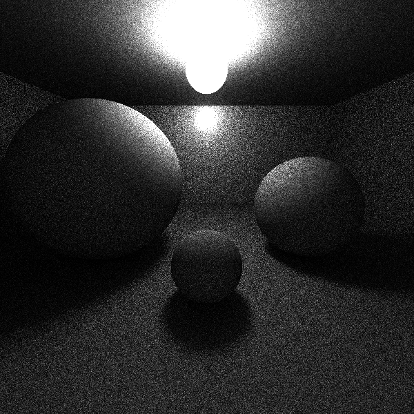

# pytracer
A toy implementation of path-tracer.

<p align="center"></p>

Example use:
```python
    from math import pi
    from path_tracer import Camera, Material, Sphere, Triangle, PathTracer, Vec3, save_img

    camera = Camera(
        position=Vec3(0, 2, 8.5),
        target=Vec3(0, 0, 0),
        up=Vec3.up,
        resolution=(300, 300),
    )

    scene = (
        Sphere(Vec3(-4.0, 0, 0), 2.0, Material(0, 1.0 / pi)),
        Sphere(Vec3(0, -1.0, 3), 1.0, Material(0, 1.0 / pi)),
        Sphere(Vec3(0, 5, 0), 0.75, Material(19550, 0.0)),
        Triangle(Vec3(-10, -2, -10), Vec3(10, -2, 10), Vec3(10, -2, -10), Material(0, 1 / pi)),
        Triangle(Vec3(-10, -2, -10), Vec3(-10, -2, 10), Vec3(10, -2, 10), Material(0, 1 / pi)),
    )

    ptracer = PathTracer()
    img = ptracer.render(camera, scene, samples=32)
    save_img("image.ppm", img)
```
